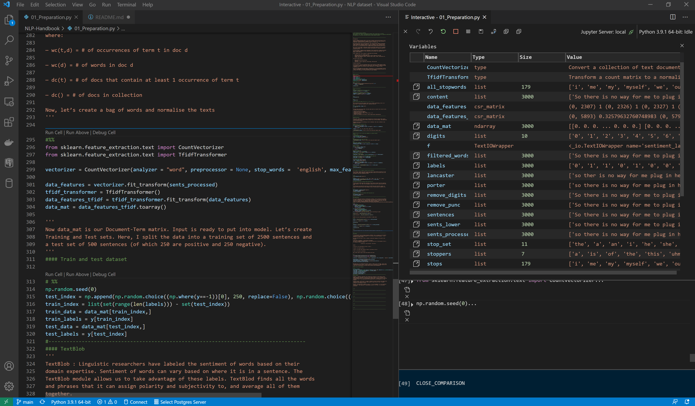

# NLP Sentiment Analysis Handbook

A Step-By-Step Approach to Understand TextBlob, NLTK, Scikit-Learn, and LSTM  networks 
applied to Sentiment Analysis.

Adaptation, corrections and modifications by Mauro Benetti 03-2021

This article is base on :

* https://towardsdatascience.com/nlp-sentiment-analysis-for-beginners-e7897f976897
* https://www.mdeditor.tw/pl/pISR/zh-hk
* https://stackabuse.com/removing-stop-words-from-strings-in-python/

For aditonal information you can visit:
* https://www.datacamp.com/community/tutorials/stemming-lemmatization-python
* http://www.nltk.org/data.html

-------------------------------------------------------------------------------------

# Introduction

**Natural Language Processing** (NLP) is the area of machine learning that focuses on the 
generation and understanding of language. Its main objective is to enable machines to 
understand, communicate and interact with humans in a natural way.

NLP has many tasks such as Text Generation, Text Classification, Machine Translation, 
Speech Recognition, Sentiment Analysis, etc. For a beginner to NLP, looking at these 
tasks and all the techniques involved in handling such tasks can be quite daunting. 
And in fact, it is very difficult for a newbie to know exactly where and how to start.

Out of all the NLP tasks, I personally think that Sentiment Analysis (SA) is probably 
the easiest, which makes it the most suitable starting point for anyone who wants to 
start go into NLP.

In this article, I compile various techniques of how to perform SA, ranging from simple 
ones like TextBlob and NLTK to more advanced ones like Sklearn and Long Short Term 
Memory (LSTM) networks.

After reading this, you can expect to understand the followings:

*   Toolkits used in SA: TextBlob and NLTK
*   Algorithms used in SA: Naive Bayes, SVM, Logistic Regression and LSTM
*   Jargons like stop-word removal, stemming, bag of words, corpus, tokenisation etc.
*   Create a word cloud

The flow of this article:

*   Data cleaning and pre-processing
*   TextBlob
*   Algorithms: Logistic Regression, Naive Bayes, SVM and LSTM
    
## Problem 

In this article, we will work with a data set that consists of 3000 sentences coming 
from reviews on imdb.com, amazon.com, and yelp.com. Each sentence is labeled according 
to whether it comes from a positive review (labelled as 1) or negative review 
(labelled as 0).

Data can be downloaded from the website. Alternatively, it can be downloaded from here 
(highly recommended). The folder sentiment_labelled_sentences(containing the data file 
full_set.txt) should be in the same directory as your notebook.

## Content of the repository

Included in this repository, the file '01_Preparation.py' is written to be excecuted in 
VS Code with a interactive python sesion. A jupyter notebook and a markdown version of 
the notebook is included due to the convinience for reading as a book. Also a folder with 
5 datasets already labelled.

## Advantages of runing on VS Code instead a Jupyter Notebook

The folowing tutorial explains the VS Code feature:
https://code.visualstudio.com/docs/python/jupyter-support-py#_python-interactive-window

This is a game changer when writing Python code for analysis because you no longer need 
to code in a Jupyter Notebook to execute your analysis. Simply write your code in a .py 
file and press Shift+ENTER to execute line-by-line in the Python Interactive Window. 

Repeat this process as you run code, explore, and build out your analysis. Note that you 
can also type Python directly into the Interactive Window just like you can type directly 
in R’s Console as well to execute code.

With this aproach we aboid the limitatons on the version control presented by Jupyter 
Notebooks.

It is possible to see all the variables created and their type, in a similar fashion as 
R-Studio.

  

For more information visit (https://code.visualstudio.com/docs/python/jupyter-support-py)

